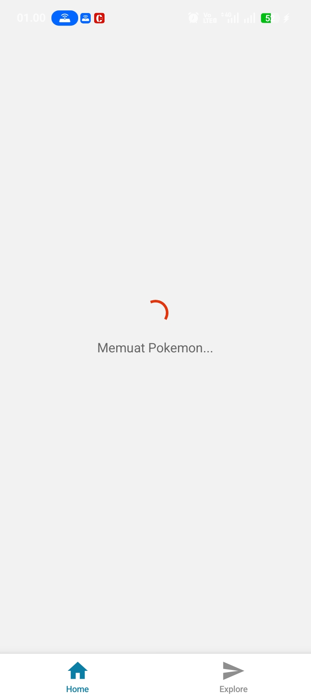
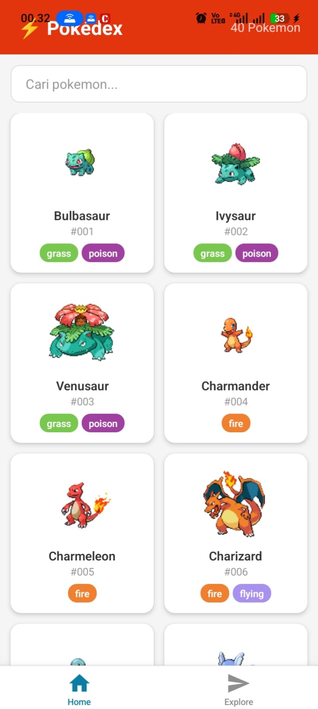
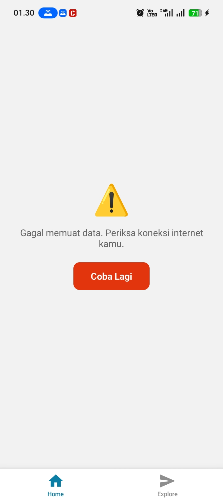
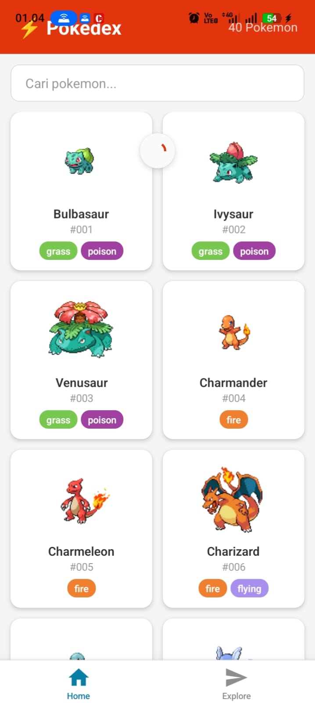
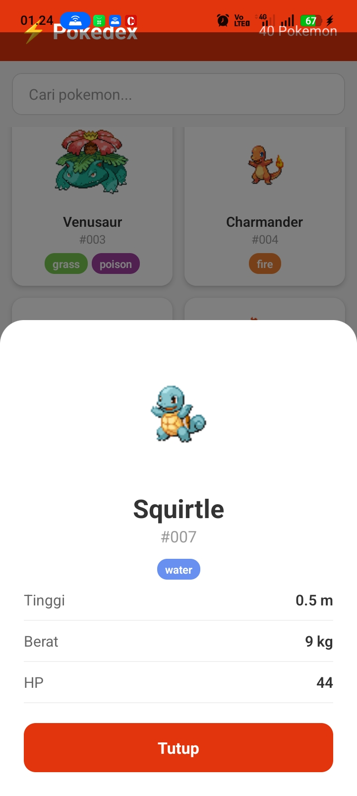

# ⚡ Pokédex App — Misi 11: Build Your Own API App

Aplikasi mobile React Native (Expo) yang menampilkan data Pokemon dari **PokeAPI**, lengkap dengan search, pull-to-refresh, dan layar detail.

---

## 📱 Screenshot

| Loading | Success | Error |
|---------|---------|-------|
|  |  |  |

| Search/Filter | Pull-to-Refresh | Detail Modal |
|---------------|-----------------|--------------|
|  |  |  |

---

## 🌐 API yang Digunakan

**PokeAPI** — `https://pokeapi.co/api/v2/pokemon`
- Gratis, tanpa API key
- Mengembalikan array list pokemon

---

## ✅ Daftar Fitur

### 🟢 Level 1 — Core
- [x] Fetch data dari PokeAPI dengan `async/await`
- [x] `useEffect` dengan dependency array `[]`
- [x] 3 kondisi UI: Loading · Error · Success
- [x] `try / catch / finally`
- [x] `FlatList` dengan `keyExtractor`
- [x] Kartu menampilkan 4 field: gambar, nama, ID, tipe
- [x] Tombol **"Coba Lagi"** saat error

### 🟡 Level 2 — Pengembangan
- [x] 🔄 **Pull-to-Refresh**
- [x] 🔎 **Search / Filter** lokal berdasarkan nama
- [x] 📄 **Layar Detail** — modal dengan tinggi, berat, HP, tipe

---

## 🚀 Cara Menjalankan

```bash
git clone https://github.com/USERNAME/NAMA-REPO.git
cd NAMA-REPO
npm install
npx expo start
```
Scan QR code dengan **Expo Go** di HP.

---

## 🛠️ Tech Stack

| Teknologi | Versi |
|-----------|-------|
| React Native | 0.81.5 |
| Expo | ~54.0.34 |
| Expo Router | ~6.0.23 |
| TypeScript | ~5.9.2 |
| PokeAPI | - |

---

## 🔗 Link

- **Expo Snack:** (https://snack.expo.dev/@boraborii/-pokedex-app)
- **GitHub Repo:** (https://github.com/rikapandia/MyApiApp)
